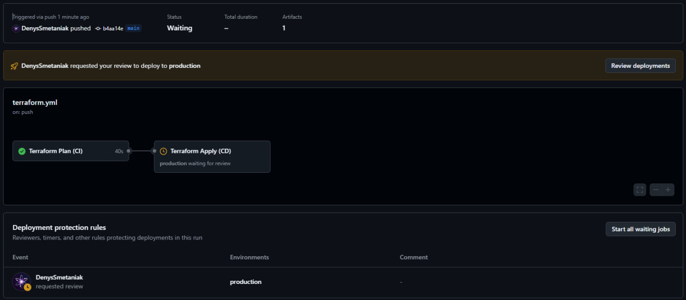

# Infrastructure setup with EFS, ECS, and ALB

## **Objective**
This project aims to create a simple AWS infrastructure using **Terraform** to deploy a basic web application. The setup includes:
- **Amazon EFS** for storing HTML content.
- **Amazon ECS (Elastic Container Service)** for running an Nginx container.
- **Application Load Balancer (ALB)** for handling incoming traffic.
- **Security Groups** for controlling network access.

---

## **1. AWS infrastructure components**

### **Amazon EFS (Elastic File System)**
- Created an **Amazon EFS file system** named **`tm-devops-trainee-efs`**.
- Ensured that the EFS file system is **mounted on ECS instances** to store HTML content.
- Applied appropriate **security group settings** to restrict unauthorized access.

### **Amazon ECS (Elastic Container Service)**
- Defined an **ECS task definition** that runs an **Nginx container**.
- Used **a public Docker image of Nginx** from Docker Hub.
- Configured **EFS volume mount** inside the ECS container to serve the HTML content.
- Created an **ECS service** with **1 running task**.

### **Application Load Balancer (ALB)**
- Created an **ALB named `tm-devops-trainee-alb`**.
- Configured an **ALB listener on port 80** to forward traffic to the ECS service.
- Implemented **health checks** to monitor the availability of the ECS service.

### **Security Groups**
- Created **separate security groups** for ECS instances and ALB.
- Allowed **incoming traffic on port 80** from ALB to ECS instances.
- Configured appropriate **firewall rules** to enhance security.

### **Web Application**
- Created a **simple HTML page** with content:
  ```html
  Hello, TechMagic!
  ```
- Stored the **HTML page inside Amazon EFS**.
- Configured the **Nginx container** to serve this HTML content.

---

## **2. Terraform implementation**
Terraform was used to define all the AWS resources in a **modular, reusable, and maintainable** way.

### **Project structure**
```bash
terraform/
├── alb.tf
├── backend.tf
├── ec2
│    └── ec2.tf
├── ecs.tf
├── efs.tf
├── init_efs.sh
├── main.tf
├── outputs.tf
├── s3.tf
├── security_group.tf
├── target_group.tf
├── terraform.tfvars
├── variable.tf
└── vpc.tf

```

---

## **3. Deployment instructions**

### **Pre-requisites**
- **Terraform v1.9.8 or later** installed.
- **AWS CLI** installed and configured with IAM credentials.
- **GitHub Actions configured** for CI/CD deployment.

### **Steps to deploy**
#### **Step 1: clone the repo**
```bash
git clone https://github.com/DenysSmetaniak/simple-AWS-infrastructure
cd terraform
```

#### **Step 2: configure AWS credentials**
```bash
export AWS_ACCESS_KEY_ID="your-access-key"
export AWS_SECRET_ACCESS_KEY="your-secret-key"
export AWS_REGION="eu-central-1"
```
Alternatively, use **AWS CLI**:
```bash
aws configure
```

#### **Step 3: initialize terraform**
```bash
terraform init
```

#### **Step 4: formating configuration**
```bash
terraform fmt
```

#### **Step 5: validate configuration**
```bash
terraform validate
```

#### **Step 6: plan deployment**
```bash
terraform plan -out=tfplan
```

#### **Step 7: apply deployment**
```bash
terraform apply -auto-approve tfplan
```
#### **Step 8: connect to the container and create the file**
To list running ECS tasks, use:
```bash
aws ecs list-tasks --cluster tm-devops-trainee-cluster
```

To connect to the running ECS container, execute the following command:
```bash
aws ecs execute-command --cluster tm-devops-trainee-cluster \
  --task $(aws ecs list-tasks --cluster tm-devops-trainee-cluster --query "taskArns[0]" --output text) \
  --container nginx-container \
  --interactive --command "/bin/sh"
```

#### **Step 9: verify system installation**
Check if the system is properly installed by running:
```bash
df -h
```

#### **Step 10: run EFS initialization script**
Execute the following command inside the container:
```bash
./init_efs.sh
```

#### **Step 11: get ALB public URL**
```bash
terraform output alb_dns_name
```
Now, open the **ALB DNS name** in your browser to see the **Hello, TechMagic!** page.

---

## **4. CI/CD with GitHub Actions**
GitHub Actions was used to **automate infrastructure deployment**.

### **Workflow overview**
- **Terraform Plan (`test` job)**: Runs on every `push` or `pull_request` to `main`.
- **Terraform Apply (`production` job)**: Runs **only after manual approval** in `GitHub Environments`.

### **GitHub Actions workflow**
```yaml
name: Terraform Deployment

on:
  push:
    branches:
      - main
  pull_request:
    branches:
      - main

env:
  AWS_REGION: "eu-central-1"

jobs:
  test:
    name: Terraform Plan (CI)
    runs-on: ubuntu-latest
    environment: test

    steps:
      - name: Checkout repository
        uses: actions/checkout@v4

      - name: Set up Terraform
        uses: hashicorp/setup-terraform@v2

      - name: Terraform Init
        run: terraform init -backend-config="bucket=${{ secrets.TF_STATE_BUCKET }}" -backend-config="dynamodb_table=${{ secrets.TF_LOCK_TABLE }}" -input=false
        env:
          AWS_ACCESS_KEY_ID: ${{ secrets.AWS_ACCESS_KEY_ID }}
          AWS_SECRET_ACCESS_KEY: ${{ secrets.AWS_SECRET_ACCESS_KEY }}
        working-directory: terraform

      - name: Terraform Format
        run: terraform fmt -check
        working-directory: terraform

      - name: Terraform Validate
        run: terraform validate
        working-directory: terraform

      - name: Terraform Plan
        run: terraform plan -out=tfplan
        env:
          AWS_ACCESS_KEY_ID: ${{ secrets.AWS_ACCESS_KEY_ID }}
          AWS_SECRET_ACCESS_KEY: ${{ secrets.AWS_SECRET_ACCESS_KEY }}
          AWS_REGION: ${{ env.AWS_REGION }}
          TF_VAR_certificate_arn: ${{ secrets.TF_VAR_CERTIFICATE_ARN }}
        working-directory: terraform

      - name: Upload Terraform Plan
        uses: actions/upload-artifact@v4
        with:
          name: tfplan
          path: terraform/tfplan


  production:
    name: Terraform Apply (CD)
    needs: test
    runs-on: ubuntu-latest
    environment:
      name: production
    if: github.ref == 'refs/heads/main'

    steps:
      - name: Checkout repository
        uses: actions/checkout@v4

      - name: Download Terraform Plan
        uses: actions/download-artifact@v4
        with:
          name: tfplan
          path: terraform

      - name: Set up Terraform
        uses: hashicorp/setup-terraform@v2

      - name: Terraform Init
        run: terraform init -backend-config="bucket=${{ secrets.TF_STATE_BUCKET }}" -backend-config="dynamodb_table=${{ secrets.TF_LOCK_TABLE }}" -input=false
        env:
          AWS_ACCESS_KEY_ID: ${{ secrets.AWS_ACCESS_KEY_ID }}
          AWS_SECRET_ACCESS_KEY: ${{ secrets.AWS_SECRET_ACCESS_KEY }}
        working-directory: terraform

      - name: Terraform Apply
        run: terraform apply -auto-approve tfplan
        env:
          AWS_ACCESS_KEY_ID: ${{ secrets.AWS_ACCESS_KEY_ID }}
          AWS_SECRET_ACCESS_KEY: ${{ secrets.AWS_SECRET_ACCESS_KEY }}
          TF_VAR_certificate_arn: ${{ secrets.TF_VAR_CERTIFICATE_ARN }}
        working-directory: terraform
```

---

## **5. Infrastructure diagram**
Schematic diagram of the main resources in AWS


---

## **6. Best practices followed**
- **Used Terraform modules** for modular infrastructure.
- **Implemented security best practices**.
- **Used ALB health checks** to maintain high availability.
- **Automated deployment with GitHub Actions**.

---

## **7. Conclusion**
This project provisions **EFS, ECS, and ALB** using Terraform and deploys a simple **web application** inside **AWS ECS**. The infrastructure follows **AWS best practices**, and the deployment process is automated using **GitHub Actions**.

## **8. Result of work**

Push code into GitHub


Successful completion of the testing phase and request for confirmation of deployment to the prod


Successful completion of two stages of pipelining


Resource group into AWS 


Road tasks in load balancers


And finally, congratulations to TechMagic


🚀 **Now your AWS infrastructure is fully automated!**

